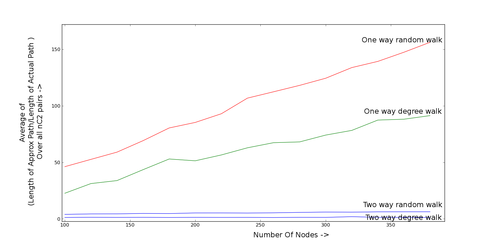

Bidirectional Search
===================

The code for "A Bidirectional Search Algorithm in Power Law Networks"

Central idea of algorithm :

- Scale Free Networks follow a power law degree distribution. Hence, a hierarchy of nodes is formed. We exploit this fact in our algorithm to navigate through the network.
- The walkers A and B start the navigation with the source and the destination nodes in a parallel fashion.
- At each stage, the walkers hop to that neighbor with the highest degree. The intuition behind this algorithm is that the shortest path between any two nodes in the network passes through the hubs in the network.
- When one of the walkers intersects the path of the other, we find the node common to both the paths and integrate the path from the source and the destination.
- The contrasting difference between this algorithm and our previous algorithm is the availability of global information.
- In our previous algorithm, we had assumed that we have the global knowledge of the network. But in the current algorithm, we use only local information in order to navigate within the network.

